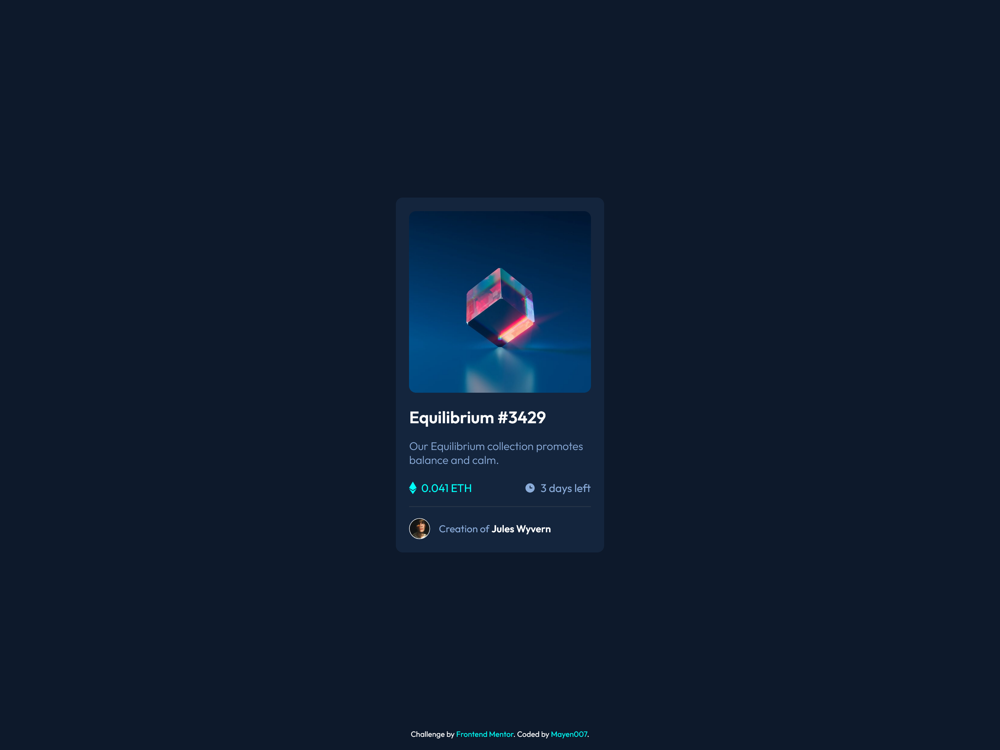

# Frontend Mentor - NFT Preview Card Component Solution

This is a solution to the [NFT Preview Card Component Challenge on Frontend Mentor](https://www.frontendmentor.io/challenges/nft-preview-card-component-SbdUL_w0U). This project helps you practice responsive web design and CSS hover effects.

## Table of Contents

- [Overview](#overview)
  - [The Challenge](#the-challenge)
  - [Screenshot](#screenshot)
  - [Links](#links)
- [My Process](#my-process)
  - [Built With](#built-with)
  - [What I Learned](#what-i-learned)
  - [Continued Development](#continued-development)
  - [Useful Resources](#useful-resources)
- [Author](#author)
- [Acknowledgments](#acknowledgments)

## Overview

### The Challenge

Users should be able to:

- View the optimal layout depending on their device's screen size.
- See hover states for interactive elements like the image overlay and clickable text.

### Screenshot



### Links

- [Solution URL](https://github.com/Mayen007/NFT-Preview-Card) - View the code on GitHub
- [Live Site URL](https://mayen007.github.io/NFT-Preview-Card/) - Check out the live demo

## My Process

### Built With

- **HTML5** for the structure
- **CSS3** for styling, with a focus on:
  - Flexbox for layout control
  - CSS variables for maintainable color management
  - Custom font integration using the "Outfit" font family
  - Hover effects for interactive elements
- **Responsive Design** using a mobile-first workflow

### What I Learned

This project was a great way to practice working with:

1. **CSS Variables:** Using variables for colors made it easy to maintain consistency across the design.
   ```css
   :root {
     --cyan: hsl(178, 100%, 50%);
   }
   ```
2. **Hover Effects:** Adding an overlay effect on the image during hover.

```CSS
.image-container:hover .overlay {
  display: flex;
  cursor: pointer;
}
```

3. **Flexbox Layouts:** Implementing Flexbox for elements like the value and time section.

```CSS
.value-time-div {
  display: flex;
  justify-content: space-between;
}
```

### Continued Development

Moving forward, I plan to:

- Experiment with **CSS Grid** for more complex layouts in future projects.
- Enhance the accessibility of components by adding ARIA labels and better alt text descriptions.
- Improve my skills in using **JavaScript** to add dynamic content and interactivity to similar projects.

### Useful Resources

- [MDN Web Docs - Flexbox Guide](https://developer.mozilla.org/en-US/docs/Web/CSS/CSS_Flexible_Box_Layout/Basic_Concepts_of_Flexbox) - Helped in understanding how to effectively use Flexbox for layout control.
- [The Markdown Guide](https://www.markdownguide.org/) - Assisted in formatting this README.

## Author

- GitHub - [Mayen007](https://github.com/Mayen007)
- Frontend Mentor - [@Mayen007](https://www.frontendmentor.io/profile/Mayen007)

## Acknowledgments

Thanks to Frontend Mentor for the great challenge. This project was a good exercise in practicing fundamental HTML and CSS skills.
